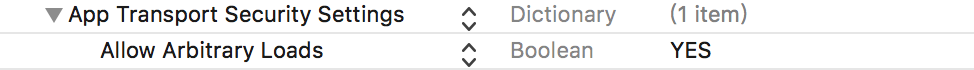

# AdMuing

这里是iOS版本说明，android的在[这里](https://github.com/admuing/admuing-android)。

[英文版说明](admuing-iOS/README.md)

## 关于

AdMuing是一个视频广告弹幕增强工具，是由多年研究Google,Facebook的创意团队创建的开源项目，目的是为了改变现有视频广告样式单一，很难全球化的问题，通过AdMuing简单几行代码就可以让原有的视频广告更生动，更有趣，更有互动性，提升开发者APP广告质量，让视频广告对用户更具有吸引力。

## Demo 

源码：请下载当前项目，查看admuing文件夹。

demo：这个demo包含了在unity和vungle SDK中的使用示例。

## 特色

* 免费：在使用期间，完全免费 (因为服务器压力每天限制10,000次广告请求)
* 开源：GitHub上每行代码清晰可见，完全透明化，完全不用担心恶意代码程序调用
* 小巧：iOS和Android SDK 仅仅不到50K
* 简单：4、5行代码，从开始到测试完成 <5分钟
* 全球化：支持16种语言，200+国家，根据不同地区的APP显示不同语言文字，不同弹幕样式及颜色，
* 三方平台支持：兼容支持Unity,Vungle等主流Video视频广告，集成后立刻显示，不影响也不改变原有的Video SDK任何功能及逻辑


## 如何使用

#### 申请一个key

到 [这里](http://register.admuing.com/) 注册一个账号，获取appkey.


#### Usage

* 下载当前项目，将里边的admuing文件加入到你的工程中.
* import "AdTimingDMManager.h".
* 设置弹道数目.

 ```
    [[ADmuingDMManager shareDMInstance] setTrajectoryNumber:6];
 ```
 
* 获取弹幕内容，通过appkey.
 
 ```
    [[ADmuingDMManager shareDMInstance] loadCommentsWithAdPackgeName:@"" andAppKey:dm_app_key];
 ```

* 在视频开始播放的时候调用，将弹幕展示出来.

 ```
   [[ADmuingDMManager shareDMInstance] start];
 ```
 
* 视频播放结束后移除弹幕.

 ```
   [[ADmuingDMManager shareDMInstance] stop];
 ```

##### 为了支持http请求，请在info.plist文件下做如下配置

   

## 备注

* 当前支持平台：Unity,Vungle,AdTiming，不断更新中...，理论支持全部视频广告SDK，但需要进行调试，如果需要支持更多平台，请联系<font color=red>support@admuing.com</font>。
* 当前仅支持iOS7.0以上。

## 支持

* 创建issue在Github
* 支持邮箱：support@admuing.com

我们会尽力回复